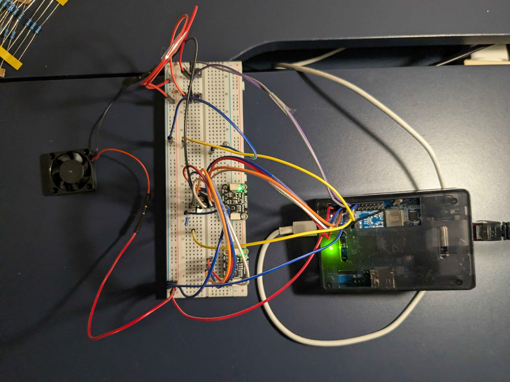
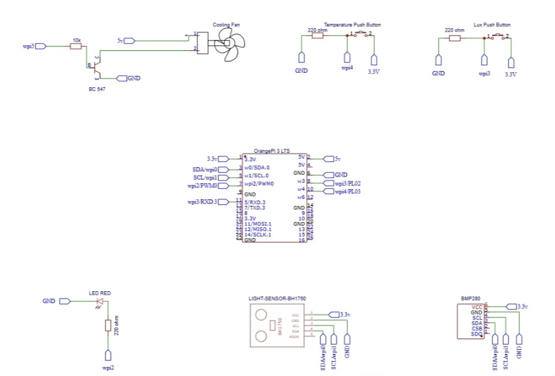

# Smart Environment Control System
An Orange Pi-based IoT system that monitors and controls light intensity and temperature using sensors (BH1750 &amp; BMP280), with automated LED and fan control and real-time cloud monitoring via MQTT (ThingSpeak).

Features:- 
- Real-time light (Lux) monitoring using BH1750 sensor
- Temperature monitoring using BMP280 sensor
- Automatic LED brightness control using PWM
- Fan control based on temperature threshold
- Adjustable target values via physical buttons
- Cloud data logging using MQTT (ThingSpeak)

How It Works:- 
- The system continuously reads light and temperature data
- Compares values with user-defined targets
- Adjusts LED brightness and fan accordingly
- Sends data to ThingSpeak via MQTT for remote monitoring

Hardware Used:- 
- Orange Pi
- BH1750 Light Sensor
- BMP280 Temperature Sensor
- LED (PWM controlled)
- Cooling Fan
- Push Buttons
- Breadboard & Jumper Wires

Project Setup 

Circuit Diagram

